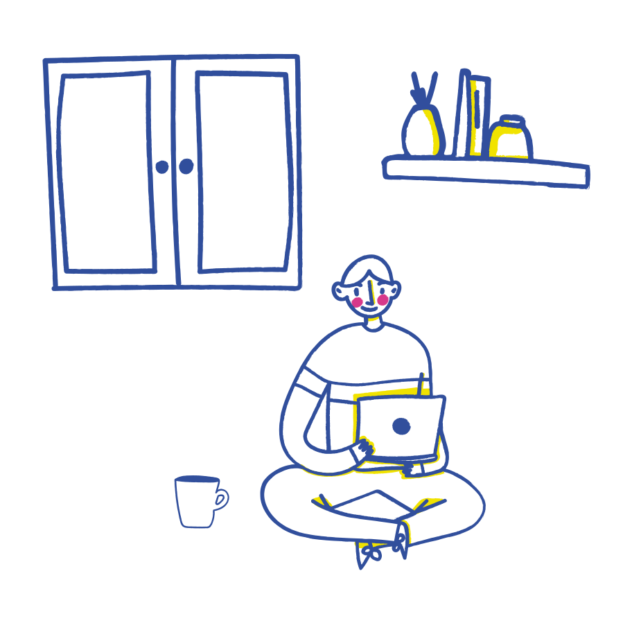

# ChristianECG

<table>
	<tr>
		<td>
			

				Soy un desarrollador de software full-stack, activamente trabajando en lenguajes como Java, PHP, Kotlin y Python. En general, admiro a la gente que insiste en encontrar formas de emocionarse.
			

			

				telescopeActualmente estoy trabajando como desarrollador y consultor independiente en Hidalgo, México.
			

			

    			:seedling:Estoy aprendiendo acerca de React JS y React Native (Nunca parar de aprender)
			

			

    			:dancers:Si lo deseas, podemos crear algo juntos, escríbeme a contacto@christianecg.com
			

			

    			:book:También puedes leer mi blog en https://christianecg.com/blog
			

			

    			:speech_balloon:¡Soy del grupo de quienes le añadieron el π a la pizza!
			

			

    			:zap:También soy escritor y crítico de libros y cine.
    		

    	</td>
    	<td></td>
    </tr>

</table>
